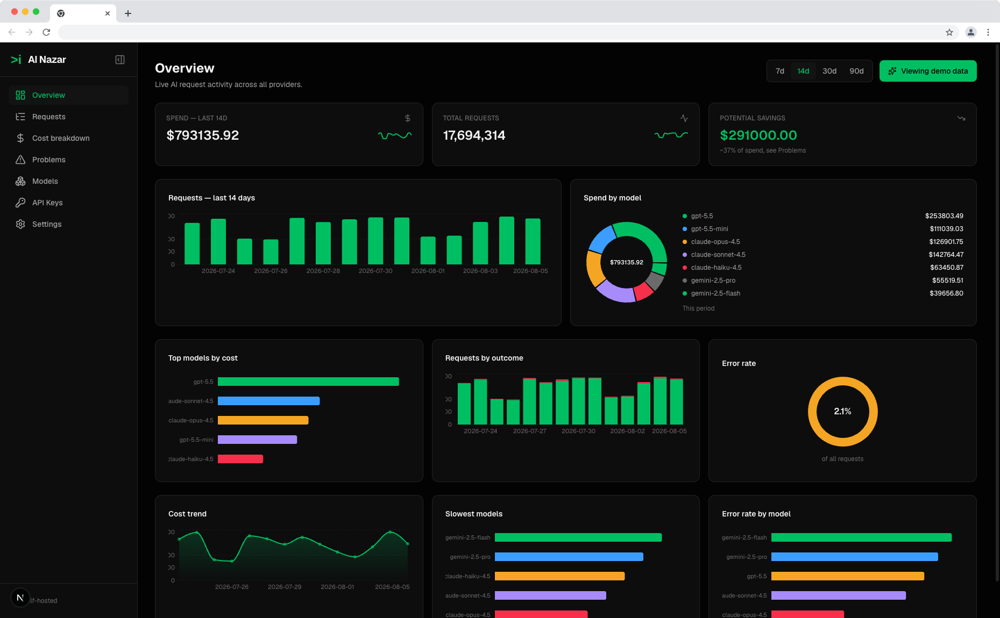

<p align="center">
  
</p>

<h1 align="center">AI Nazar Dashboard</h1>

<p align="center">
  <a href="https://github.com/harshalone/ai-nazar/actions/workflows/ci.yml"></a>
  <a href="./LICENSE"></a>
  <a href="https://github.com/harshalone/ai-nazar/releases"></a>
  <a href="https://github.com/harshalone/ai-nazar/stargazers"></a>
  <a href="https://github.com/harshalone/ai-nazar/issues"></a>
</p>

The open-source dashboard for [AI Nazar](https://github.com/harshalone/ai-nazar-sdk): a
drop-in wrapper for your OpenAI client that shows every request's cost, latency,
tokens, and errors in real time. **No login, no account, no signup** — clone it,
run it, get an API key, paste it into the SDK.

**[Live demo →](https://ainazar.com)**

<p align="center">
  
</p>

<p align="center">
  <a href="#quick-start">Quick start</a> •
  <a href="#why-no-login-in-v1">Why no login</a> •
  <a href="#architecture">Architecture</a> •
  <a href="#scripts">Scripts</a> •
  <a href="#switching-backends">Switching backends</a> •
  <a href="#contributing">Contributing</a> •
  <a href="#license">License</a>
</p>

## Quick start

```bash
git clone https://github.com/harshalone/ai-nazar.git
cd ai-nazar
npm install
npm run dev
```

Open [http://localhost:3000](http://localhost:3000). You'll land on a
one-time setup screen (not a login) to pick where events are stored:

- **SQLite** (default) — zero config, creates `./data/nazar.db` automatically.
- **Postgres** — paste a connection string.
- **Postbase** — paste your [Postbase](https://www.getpostbase.com) project
  URL, service role key, and project ID (run `prisma/postbase/schema.sql`
  in your Postbase SQL editor first).

Once configured, the dashboard shows your API key immediately. Paste it
into the SDK:

```ts
import OpenAI from "openai";
import { Nazar } from "@lonare/ai-nazar-sdk";

const nazar = Nazar.init({
  apiKey: "nz_live_xxxxx", // from the dashboard
  endpoint: "http://localhost:3000",
});

const openai = Nazar.wrapOpenAI(new OpenAI());
```

Every request made through `openai` now shows up on the dashboard.

## Why no login in v1

AI Nazar's SDK is built around minimizing what a new user has to trust
before they see value (see the SDK's `ARCHITECTURE.md` for the same
philosophy applied to `wrapOpenAI`). The dashboard follows the same
principle: the fastest path from `git clone` to "I can see my AI
requests" is the one worth optimizing for first. Multi-user accounts,
login, and team access control are real requirements for a hosted or
team-shared deployment — they're deliberately deferred to a later
version rather than gating the very first run behind them.

## Architecture

- **Storage is pluggable.** Every backend (SQLite, Postgres, Postbase)
  implements the same `EventsStore` interface
  (`src/lib/store/types.ts`) — insert, query, aggregate, and API key
  management. The rest of the app (ingestion route, dashboard pages)
  only ever talks to that interface, never to a specific driver.
- **SQLite and Postgres** share one Prisma schema shape
  (`prisma/sqlite/schema.prisma` and `prisma/postgres/schema.prisma`,
  kept structurally identical) and one query implementation
  (`src/lib/store/prisma-shared.ts`), instantiated via Prisma 7's driver
  adapters (`@prisma/adapter-better-sqlite3`, `@prisma/adapter-pg`) so
  the connection is resolved at runtime from `.env.local`, not baked in
  at build time.
- **Postbase** talks directly to `postbasejs` (REST, no Prisma) against
  the hand-written `prisma/postbase/schema.sql`, using the same
  camelCase column names as the Prisma-generated schema so there's no
  translation layer between adapters.
- **Ingestion** (`POST /api/v1/events`) is a Next.js route handler in
  this app — validates the SDK's Bearer API key, then calls
  `store.insertEvent()`. It's excluded from the setup gate (see below)
  so the SDK always gets a real HTTP response, never a redirect.
- **The setup gate** lives in `src/proxy.ts` (Next.js 16 renamed
  `middleware.ts` to `proxy.ts`). It redirects every route to `/setup`
  until a backend is configured. Note: `proxy.ts` is bundled separately
  by Next.js and does not resolve imports from `src/lib` — the
  "is configured" check is intentionally duplicated there in a
  self-contained form; keep it in sync with
  `src/lib/config/env.ts#readNazarConfig` by hand if either changes.
- **UI**: black-first theme (see `src/app/globals.css`) built around the
  AI Nazar logo's brand green, with amber/red as semantic
  warning/error signals on charts and stat tiles. The collapsible
  icon-rail sidebar and the global stackable slide-over panel system
  (`src/lib/slide-panel-context.tsx` +
  `src/components/ui/global-slide-panel.tsx`) were ported from a
  previously proven pattern rather than built from scratch — see inline
  comments in those files.

## Scripts

```bash
npm run dev              # start the dev server
npm run build            # production build
npm run db:generate      # regenerate both Prisma clients (runs automatically on install)
npm run db:migrate:sqlite    # apply SQLite migrations
npm run db:migrate:postgres  # apply Postgres migrations
```

## Switching backends

Configuration lives entirely in `.env.local`, written once by `/setup`.
To switch backends, edit or remove the `NAZAR_*` block and restart the
app — you'll land back on `/setup`.

## Contributing

Contributions are welcome — see [CONTRIBUTING.md](./CONTRIBUTING.md) for
local setup, the PR workflow, and issues tagged
[`good first issue`](https://github.com/harshalone/ai-nazar/labels/good%20first%20issue)
if you're looking for a place to start.

## License

[MIT](./LICENSE)
